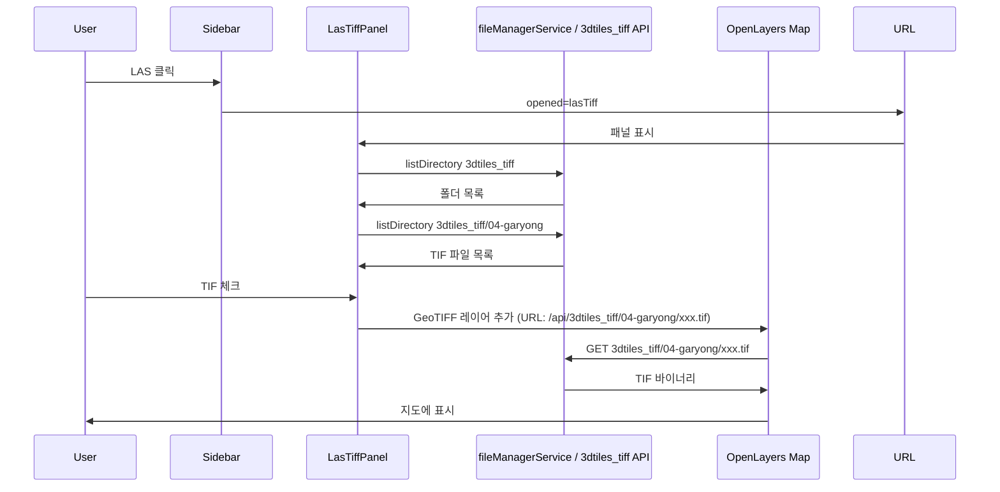

# 2D 지도 LAS GeoTIFF 패널 추가

## 결론: GeoServer 없이 가능

- **OpenLayers 10**에는 `ol/source/GeoTIFF`가 내장되어 있으며, URL로 GeoTIFF를 불러와 지도에 뿌린다.
- 서버에서 `.tif` 파일만 HTTP로 제공하면 되고, GeoServer/WMS는 필요 없다.
- 프로젝트에서 이미 `ol/layer/WebGLTile` 사용 중([backgroundLayerFactory.ts](src/app/(pages)/map/_mapComponents/backgroundLayerFactory.ts))이므로, GeoTIFF 소스와 조합하면 된다.

---

## 현재 구조 정리

- **왼쪽 서브메뉴**: [map-sidebar.tsx](src/app/(pages)/map/_mapComponents/map-sidebar.tsx) — `SidebarButton`으로 단면도, 내려받기, 필지분석 등이 있고, 클릭 시 URL `opened` 쿼리로 패널 식별(예: `landInfo`, `sectionView`).
- **패널 표시**: [layout.tsx](src/app/(pages)/map/layout.tsx) — `openedWindows.includes('landInfo')`일 때 `<LandInfo />`를 왼쪽에 렌더. 동일 패턴으로 새 패널 추가 가능.
- **디렉터리/파일 목록**: [fileManagerService.listDirectory](src/service/fileManagerService.ts)에 `relativePath`로 `service_data/3dtiles_tiff` 또는 `service_data/3dtiles_tiff/04-garyong` 전달하면 하위 디렉터리·파일 목록을 받을 수 있음.
- **3dtiles_pnts 제공**: [api/3dtiles/[[...path]]/route.ts](src/app/api/3dtiles/[[...path]]/route.ts)가 `service_data/3dtiles_pnts` 기준으로 파일을 서빙. 동일 패턴으로 **3dtiles_tiff** 전용 API가 필요.

---

## 구현 방안

### 1. 서브메뉴에 LAS 항목 추가

- **파일**: [map-sidebar.tsx](src/app/(pages)/map/_mapComponents/map-sidebar.tsx)
- **작업**: 새 `SidebarButton` 추가 (아이콘 예: `Layers` 또는 `Image`), 클릭 시 `toggleWindow('lasTiff')` 호출.
- **결과**: `?opened=lasTiff`일 때 LAS(TIF) 패널이 열린다.

### 2. 3dtiles_tiff 파일 서빙 API

- **파일**: 새로 추가 `src/app/api/3dtiles_tiff/[[...path]]/route.ts`
- **역할**: `GGNR_DATA_DIR/service_data/3dtiles_tiff` 아래 경로를 기준으로 정적 파일 서빙 (예: `GET /api/3dtiles_tiff/04-garyong/xxx.tif`).
- **참고**: [api/3dtiles/[[...path]]/route.ts](src/app/api/3dtiles/[[...path]]/route.ts)와 동일한 패턴으로, `BASE_DIR`만 `service_data/3dtiles_tiff`로 두고, `.tif`/`.tiff` 확장자에 맞는 Content-Type 설정.

### 3. LAS(TIF) 패널 컴포넌트

- **파일**: 새로 추가 `src/app/(pages)/map/_mapComponents/LasTiffPanel.tsx` (또는 `GeoTiffLayerPanel.tsx`)
- **UI**:
  - 상단: 제목 "LAS GeoTIFF", 닫기 버튼 (LandInfo와 동일한 닫기 패턴: `opened`에서 `lasTiff` 제거).
  - 폴더 선택: `service_data/3dtiles_tiff` 하위 디렉터리 목록을 `listDirectory({ relativePath: 'service_data/3dtiles_tiff' })`로 조회 후 드롭다운/리스트로 표시. 기본값은 `04-garyong`(목록에 있으면 선택).
  - TIF 목록: 선택한 폴더에 대해 `listDirectory({ relativePath: 'service_data/3dtiles_tiff/04-garyong' })`로 파일 목록 조회 후 `.tif`/`.tiff`만 필터링하여 체크박스 리스트로 표시.
- **상태**: `선택된 폴더`, `체크된 TIF 파일명 Set` (예: `Set<string>`).
- **지도 레이어 연동**: `MapContext` 또는 지도 ref로 현재 Map 인스턴스에 접근. 체크된 각 TIF에 대해:
  - `ol/source/GeoTIFF` + `ol/layer/WebGLTile` 레이어 생성.
  - 소스 URL: `/api/3dtiles_tiff/{folderName}/{fileName}` (예: `/api/3dtiles_tiff/04-garyong/04-garyong_capture.tif`).
  - 레이어에 `lasTiffLayer` 같은 커스텀 속성 부여해, 패널에서 on/off 시 해당 레이어만 visibility 토글 또는 add/remove.
- **체크 해제**: 해당 TIF 레이어를 map에서 제거하거나 visible=false.

### 4. 지도 레이어 추가/제거 훅 또는 유틸

- **위치**: [MapContext](src/app/(pages)/map/_mapComponents/MapContext.tsx)에서 `mapInstanceRef`를 이미 공유하고 있으므로, LasTiffPanel에서 `useMapContext()`로 map에 접근.
- **로직**: 체크된 TIF 목록이 바뀔 때마다(또는 폴더 변경 시) 기존 LAS GeoTIFF 레이어들을 제거하고, 새로 체크된 TIF들에 대해 GeoTIFF 소스 + WebGLTile 레이어를 생성해 `map.getLayers().push()` (또는 배경/서비스 레이어 위에 삽입할 인덱스 결정).
- **OpenLayers API**: `GeoTIFF` 소스는 비동기 로드이므로, `source.getView()` 등으로 뷰 설정이 필요할 수 있음. 일반적으로 레이어만 추가하면 기존 뷰에 맞춰 렌더링된다.

### 5. layout에 패널 노출

- **파일**: [layout.tsx](src/app/(pages)/map/layout.tsx)
- **작업**: `openedWindows.includes('landInfo') && <LandInfo />` 옆에 `openedWindows.includes('lasTiff') && <LasTiffPanel />` 조건으로 LasTiffPanel 렌더. LandInfo와 같은 왼쪽 컬럼에 배치하면 된다.

---

## 데이터 흐름 요약

---

## 주의사항

- **CORS**: 같은 오리진에서 API 호출이므로 별도 CORS 설정 불필요.
- **GeoTIFF 용량**: 대용량 TIF는 COG가 아니면 한 번에 로드될 수 있어, 초기에는 작은 캡쳐용 TIF(04-garyong 등) 위주로 검증하는 것이 좋다.
- **좌표계**: GeoTIFF에 내장된 CRS를 OpenLayers가 처리하므로, 2D 지도 뷰(EPSG:3857 등)와의 재투영은 라이브러리 내부에서 처리된다.
- **폴더 목록**: 최초에는 `04-garyong` 고정으로 구현하고, 이후 3dtiles_tiff 하위 폴더 목록을 불러와 선택 가능하게 확장하는 방식도 가능하다.

---

## 파일 변경 목록

| 구분  | 파일                                                                    | 작업                                                    |
| --- | --------------------------------------------------------------------- | ----------------------------------------------------- |
| 수정  | [map-sidebar.tsx](src/app/(pages)/map/_mapComponents/map-sidebar.tsx) | LAS 버튼 추가, `toggleWindow('lasTiff')`                  |
| 수정  | [layout.tsx](src/app/(pages)/map/layout.tsx)                          | `openedWindows.includes('lasTiff')` 시 LasTiffPanel 렌더 |
| 신규  | `src/app/api/3dtiles_tiff/[[...path]]/route.ts`                       | 3dtiles_tiff 디렉터리 정적 파일 서빙                            |
| 신규  | `src/app/(pages)/map/_mapComponents/LasTiffPanel.tsx`                 | 폴더·TIF 목록 UI, 체크 시 GeoTIFF 레이어 추가/제거                  |

이 구상대로 구현하면 GeoServer 없이 2D 지도에서 LAS 유래 GeoTIFF를 표시할 수 있다.