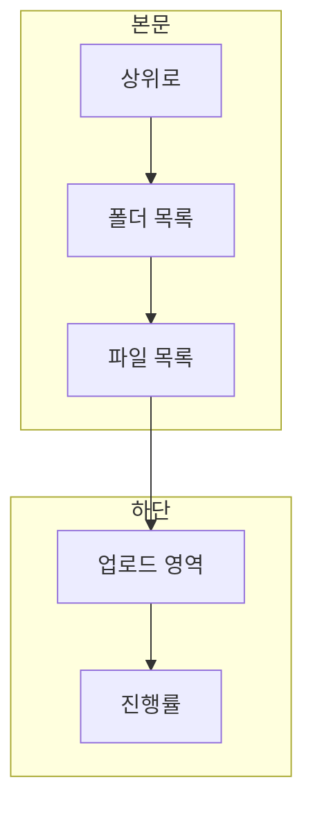

# 개발자 모드 File Manager 세부 계획

## 목표

1. **개발자 모드에 File Manager 메뉴 추가** — 기존 사이드바에 "File Manager" 항목 추가, 선택 시 File Manager 전용 화면 표시.
2. **현재 디렉터리·파일 목록 표시** — `d:\ggnr_data_dir` 하위(사업명 → service_data / upload_data 등)를 탐색할 수 있도록 폴더 목록·파일 목록 표시.
3. **대용량 파일 업로드** — 청크 단위 업로드(직접 구현)로 `upload_data/cog`, `upload_data/las` 등 지정 경로에 저장.

---

## 화면 UI 구성

- **전체 레이아웃**: **상단 없음**(사업 선택·브레드크럼 제외). **본문(목록) + 하단(업로드)** 2단. 폴더 경로에는 사업명을 넣지 않고, `upload_data`, `service_data`, `upload_data/cog` 등 **상대 경로만** 사용.

### 본문 (1행) — 디렉터리·파일 목록

- **상위로 버튼**: 현재 경로가 루트가 아니면 "상위로" 표시. 클릭 시 상위 폴더로 이동(예: `upload_data/cog` → `upload_data`, `upload_data` → `""`).
- **한 테이블에 폴더 + 파일 통합**.
  - **폴더**: 상단에 표시. 컬럼: 아이콘(폴더) + 이름, (선택) 수정일. 클릭 시 `relativePath`에 해당 폴더 추가 후 `listDirectory` 호출. 경로에 **사업명 미포함** (예: `upload_data`, `upload_data/cog`).
  - **파일**: 폴더 아래 표시. 컬럼: 아이콘(파일) + 이름, 크기(KB/MB/GB), 수정일. 행 클릭은 선택만.
- **빈 폴더/에러**: 목록 없으면 "폴더가 비어 있습니다", API 실패 시 "목록을 불러올 수 없습니다".
- **새로고침 버튼**: 같은 경로로 `listDirectory` 다시 호출.

### 하단 (2행) — 업로드

- **업로드 대상 선택**: "저장 위치" — `upload_data/cog` / `upload_data/las` 중 선택 (라디오 또는 셀렉트). 사업은 서버 설정(환경변수 등)으로 고정.
- **드래그 앤 드롭 영역**:  
  - "파일을 여기에 놓거나 클릭하여 선택" 박스. `onDrop` / `onClick` → `input type=file` 트리거.  
  - 여러 파일 선택 가능 시, 큐로 순차 업로드(한 파일 완료 후 다음) 또는 동시 1개만 업로드로 단순화.
- **진행률**:  
  - 현재 업로드 중인 파일명 + 프로그레스 바(0~100%) + (선택) "청크 n / N".  
  - 완료 시 토스트 또는 인라인 "업로드 완료" 후 목록 새로고침.
- **취소**: 업로드 중 "취소" 버튼(선택). 현재 청크 인덱스까지는 서버에 남을 수 있으므로, 재개 시 "이어받기" 또는 나중에 정리 API로 임시 청크 삭제 가능.

### 반응형·스타일

- 기존 dev 페이지와 동일: `Card` > `CardHeader`(제목/설명) > `CardContent`. 내부는 `flex flex-col gap-4` 등으로 섹션 간격.
- 목록은 `overflow-auto`로 세로 스크롤, 하단 업로드 영역은 `shrink-0`.
- 테이블은 shadcn `Table` 또는 `border rounded` div 테이블. 폴더/파일 행은 `hover:bg-muted/50`, 커서 `cursor-pointer`(폴더만).

### 컴포넌트 분리 (선택)

- `FileManagerContent`: 페이지 진입점. 목록 + 업로드 한 화면에 (사업 선택·브레드크럼 없음).
- 목록이 길어지면 `FileListTable`(폴더+파일 통합 테이블)로 분리.
- 업로드만 `ChunkedUploadZone`(드롭존 + 진행률 + `useChunkedUpload` 연동)으로 분리하면 재사용·테스트에 유리.

---

## 1. 메뉴 및 컴포넌트 연결

- **수정 파일**: [src/app/(pages)/dev/page.tsx](src/app/(pages)/dev/page.tsx)
- **할 일**
  - `DEV_SUBMENUS`에 `{ id: "fileManager", label: "File Manager" }` 추가.
  - `selectedMenu === "fileManager"` 일 때 `FileManagerContent` 렌더 (기존 DbManagerContent, GeoserverManagerContent 패턴과 동일).
- **신규 파일**: `src/app/(pages)/dev/_components/FileManagerContent.tsx`
  - 레이아웃: **본문**에 현재 경로의 폴더·파일 목록(상위로 + 테이블 + 새로고침), **하단**에 업로드 영역(저장 위치 선택 + 드래그 앤 드롭 + 진행률). 사업 선택·브레드크럼 없음, 폴더 경로는 사업명 제외(상대 경로만).

---

## 2. 디렉터리·파일 목록 API

- **베이스 경로**: `GGNR_DATA_DIR / GGNR_PROJECT` (예: `d:\ggnr_data_dir\ggnr_v7`). 사업명(프로젝트)은 환경변수 등 **서버 설정으로 고정**, API·폴더 경로에는 **사업명을 넣지 않음**.
- **API**
  - 서비스: `fileManagerService` (또는 `uploadService` 확장).
  - **액션**: `listDirectory(params: { relativePath? })`
    - `relativePath`: 베이스(위 고정 경로) 기준 **상대 경로만** (예: `""`, `upload_data`, `upload_data/cog`, `service_data/hillshade`). 비면 베이스 바로 아래 목록. **사업명 미포함.**
  - **반환**: `{ directories: string[], files: { name: string, size: number, modified?: string }[] }`.  
  - **보안**: `relativePath` 정규화 후 베이스 하위인지 검사. `..` 등 경로 이탈 차단.
- **프론트**
  - 현재 `relativePath` 상태만 유지(예: `""` → `upload_data` → `upload_data/cog`). 폴더 클릭 시 경로 추가, "상위로" 클릭 시 상위로 이동 후 `listDirectory` 재호출.
  - 응답으로 `directories`, `files` 테이블 표시.

---

## 3. 대용량 파일 업로드 (청크 업로드)

### 3.1 백엔드 (기존 파이프라인 플랜과 동일)

- **init**: `uploadService.initChunkedUpload({ uploadType: 'cog'|'las', fileName, totalSize })` → `uploadId`, `chunkSize`, `expectedChunks`. 사업(베이스)은 서버 설정 사용.
- **chunk**: `POST /api/upload/chunk` — 본문에 청크 바이너리, 파라미터 `uploadId`, `chunkIndex`, `totalChunks`. 서버는 임시 디렉터리에 청크 저장.
- **complete**: `uploadService.completeChunkedUpload({ uploadId })` — 청크 병합 후 `upload_data/cog` 또는 `las`에 저장(경로에 사업명 없음, 서버가 베이스 결정), 임시 삭제.

### 3.2 프론트: 쓸 만한 라이브러리

| 라이브러리             | 특징                                                    | 우리 API와 호환                                                                                                     |
| ----------------- | ----------------------------------------------------- | -------------------------------------------------------------------------------------------------------------- |
| **@mux/upchunk**  | 256KB 청크, PUT + Content-Range, 재개/재시도. 인기 많음.         | 서버가 **PUT + Range**를 받아야 함. 현재 설계는 **POST + chunkIndex**이므로 서버를 PUT/Range 방식으로 바꾸면 사용 가능.                      |
| **Uppy**          | 대시보드 UI, Tus 프로토콜, 재개 가능.                             | **TUS 서버** 필요. 우리가 init/chunk/complete를 유지하려면 Tus 서버를 추가하거나, Uppy의 custom provider로 우리 API에 맞춰 래핑 가능하나 작업량 있음. |
| **React-Uploady** | Tus·청크 지원, 컴포넌트/훅.                                    | TUS 또는 커스텀 엔드포인트. 우리 API에 맞춰 커스텀 훅으로 연동 가능.                                                                    |
| **use-tus**       | Tus 전용 React 훅.                                       | TUS 서버 필요.                                                                                                     |
| **직접 구현**         | `File.slice()` + `fetch`로 init → chunk 반복 → complete. | **우리 API와 100% 일치.** 의존성 없음. **채택.**                                                                           |

**결정: 직접 구현.** `File.slice()` + `fetch`로 init → chunk 반복(POST) → complete. 진행률은 `(chunkIndex + 1) / totalChunks * 100`. 재개는 서버에서 "받은 청크 인덱스 목록" API를 두면 실패 시 해당 인덱스부터 재전송 가능.

### 3.3 File Manager 내 업로드 UI (위 "화면 UI 구성" 하단 섹션과 동일)

- **업로드 대상 경로**: `upload_data/cog` 또는 `upload_data/las` (저장 위치만 선택, 사업은 서버 설정).
- **동작**: 파일 선택 또는 드래그 앤 드롭 → `uploadType`은 사용자가 cog/las 선택(확장자 자동 추정은 보조).
- **진행률**: init 후 chunk 단위 진행률 + 완료 시 목록 새로고침.

---

## 4. 구현 순서 (세부)

1. **fileManagerService (또는 기존 서비스 확장)**
  - `listDirectory({ relativePath })` 구현. 베이스 = `GGNR_DATA_DIR` + `GGNR_PROJECT`(환경변수 등).  
  - Node `fs.readdir` + `fs.stat`으로 디렉터리/파일 구분, 경로 검증 후 JSON 반환. 폴더 경로에 사업명 미포함.
2. **개발자 모드 메뉴**
  - [page.tsx](src/app/(pages)/dev/page.tsx)에 File Manager 메뉴 및 `FileManagerContent` 연결.
3. **FileManagerContent.tsx** (위 "화면 UI 구성" 대로)
  - 본문: "상위로" + 폴더·파일 통합 테이블 + 새로고침. 폴더 클릭 시 relativePath 갱신 후 `listDirectory` 재요청. 사업 선택·브레드크럼 없음.
  - 하단: 저장 위치(cog/las) 선택 + 드래그 앤 드롭 + 진행률 + (선택) 취소.
4. **청크 업로드 클라이언트**
  - **직접 구현**: `useChunkedUpload` 훅. init → chunk 반복(POST) → complete, 진행률 state, 에러 시 재시도(선택). 재개는 서버에 "받은 청크 목록" API 있으면 미전송 청크만 재전송.
5. **uploadService (백엔드)**
  - `initChunkedUpload`, `uploadChunk`, `completeChunkedUpload` 구현 (기존 파이프라인 플랜 1.2절 대로).  
  - 청크 수신은 Next.js Route Handler(`/api/upload/chunk`)에서 `request.arrayBuffer()`로 본문 받아 서비스에 전달.

---

## 5. 파일·참고 구조

| 구분               | 경로                                                                  |
| ---------------- | ------------------------------------------------------------------- |
| Dev 페이지          | [src/app/(pages)/dev/page.tsx](src/app/(pages)/dev/page.tsx)        |
| File Manager 콘텐츠 | `src/app/(pages)/dev/_components/FileManagerContent.tsx` (신규)       |
| 목록 API 서비스       | `src/service/fileManagerService.ts` (신규) 또는 uploadService 확장        |
| 청크 업로드 훅         | `src/app/(pages)/dev/_components/useChunkedUpload.ts` (신규, 옵션 A 시)  |
| 업로드 API          | uploadService + `/api/upload/chunk` Route Handler (파이프라인 플랜에 따라 구현) |

---

## 6. 정리

- **File Manager**: 개발자 모드 메뉴 1개 + 본문(상위로 + 폴더·파일 목록) / 하단(업로드) 2단 UI. 사업 선택·브레드크럼 없음. 폴더 경로는 사업명 제외(상대 경로만).
- **목록**: 베이스(`GGNR_DATA_DIR`+사업, 사업은 서버 설정) 하위만 `listDirectory(relativePath)`로 탐색, 경로 이탈 방지.
- **대용량 업로드**: init/chunk/complete API에 맞춰 **클라이언트 직접 구현** (`useChunkedUpload` 훅).

이 순서로 진행하면 개발자 모드에서 외부 데이터 폴더를 보고, 지정 경로(cog/las)로 대용량 파일을 올리는 File Manager를 완성할 수 있다.