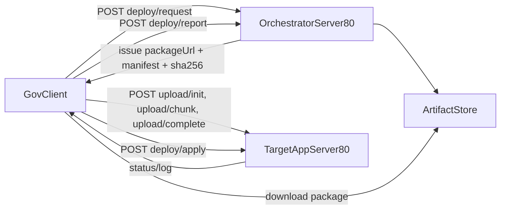

# 80포트 오케스트레이션 구축 계획

## 목표
관공서 클라이언트가 오케스트레이션 서버에서 패키지를 받아 내부 서버로 업로드하고, 내부 서버가 안전하게 배포/롤백까지 수행하는 자동화 체계를 만든다.

## 현재 자산 활용
- 기존 청크 업로드 패턴 재사용: [d:/ggnr_v7/src/app/api/upload/chunk/route.ts](d:/ggnr_v7/src/app/api/upload/chunk/route.ts), [d:/ggnr_v7/src/app/api/service-files/upload/init/route.ts](d:/ggnr_v7/src/app/api/service-files/upload/init/route.ts), [d:/ggnr_v7/src/app/api/service-files/upload/complete/route.ts](d:/ggnr_v7/src/app/api/service-files/upload/complete/route.ts)
- 프로젝트/환경 실행 진입점 재사용: [d:/ggnr_v7/scripts/run.ts](d:/ggnr_v7/scripts/run.ts)
- 프로젝트별 환경 파일 체계 재사용: [d:/ggnr_v7/scripts/load-project-env.ts](d:/ggnr_v7/scripts/load-project-env.ts), [d:/ggnr_v7/src/config/projects/build_yy.env](d:/ggnr_v7/src/config/projects/build_yy.env)

## 아키텍처

## 구현 단계
1. 배포 계약(Contract) 고정
- 요청/응답 스키마 정의: deploy request, package metadata, upload session, apply status, report
- 필수 필드 확정: project, env(dev/demo/prod), version, checksum, signer, rolloutId

2. 오케스트레이터 API 구축
- `POST /deploy/request`: 배포 요청 생성 및 승인 상태 관리
- `GET /deploy/package/:rolloutId`: 패키지/manifest/sha256 전달
- `POST /deploy/report`: 클라이언트가 업로드/적용 결과 보고
- 환경별 정책(자동/승인) 분기: dev 자동, demo/prod 승인

3. 내부 서버 배포 API 구축(80포트)
- 기존 청크 업로드 패턴으로 `/api/deploy/upload/*` 엔드포인트 추가
- `/api/deploy/apply`에서 배포 파이프 실행: 검증 → 해제 → 빌드/시작 → 헬스체크
- `/api/deploy/status/:jobId`, `/api/deploy/log/:jobId`로 진행상태/로그 조회

4. 클라이언트 에이전트 구현
- 오케스트레이터 호출 → 패키지 다운로드/해시검증 → 내부 서버 청크 업로드 → apply 호출
- 실패 재시도/중단 재개(청크 단위)
- 완료 리포트 전송

5. 배포 실행/롤백 전략 정착
- 디렉터리 표준: `releases/<version>`, `current`, `previous`
- 실패 시 자동 롤백 트리거
- 코드 패키지와 데이터 패키지 분리 전개(대용량 전송 최소화)

6. 보안/감사 강화
- 토큰 만료시간 짧게(1회성)
- SHA256 + 서명 검증(필수)
- IP allowlist 및 감사 로그(누가/언제/무엇을 배포)

7. 운영 전환
- 샌드박스(개발)에서 E2E 검증
- 시연 환경 배포 리허설
- 운영 환경 점진 전환 및 운영 Runbook 확정

## 검증 기준
- 1GB 이상 패키지 청크 업로드 성공/재개 가능
- 해시 불일치 시 즉시 실패 및 적용 차단
- apply 실패 시 롤백 자동 수행
- dev/demo/prod 배포 이력과 상태가 오케스트레이터에 일관되게 기록