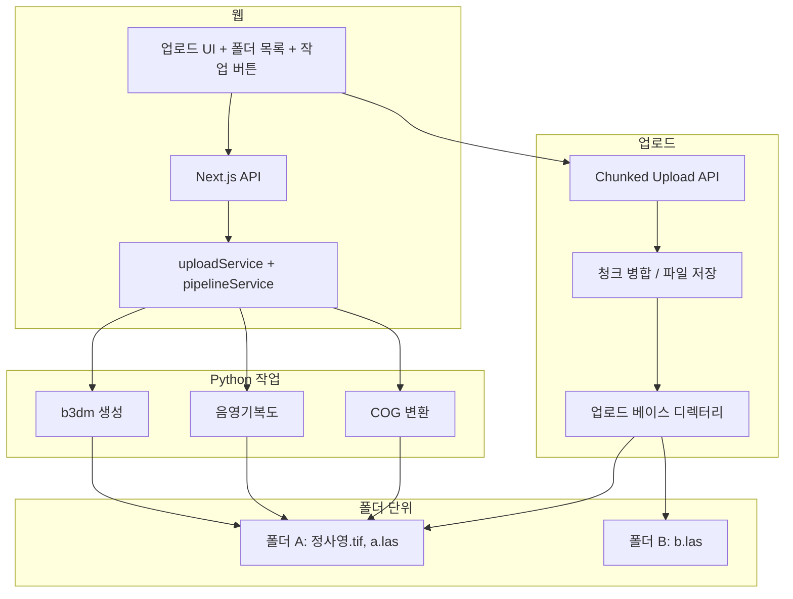

# 폴더 기준 업로드 + COG·음영기복도·b3dm 파이프라인

## 목표

1. **웹을 통해 특정 폴더에 파일 업로드**
  정사영상(GeoTIFF 등), LAS 등 다양한 데이터를 **정해진 경로**에 업로드. 대용량을 위해 **Chunked Upload**(FTP와 유사한 청크·재개 가능 업로드) 지원.
2. **웹에서 버튼으로 Python 작업 실행·결과 반환**
  선택한 폴더에 대해 Python 라이브러리로 작업을 수행하고, 완료 시 결과(출력 경로, 성공/실패, 로그 등)를 API로 반환.
3. **세부 작업 (폴더 기준)**
  - **COG 변환**: 해당 폴더 내 래스터(정사영상 등) → Cloud Optimized GeoTIFF  
  - **음영기복도 생성**: 해당 폴더 내 LAS 기반 DEM → hillshade GeoTIFF  
  - **b3dm 파일 생성**: 해당 폴더 내 LAS 기반 → 3D Tiles (Cesium용)

---

## 아키텍처




---

## 1. 웹을 통한 파일 업로드 (Chunked / 재개 가능)

### 1.1 요구사항

- **데이터 루트(외부)**: `d:\ggnr_data_dir` — 프로젝트 외부 고정 경로.
- **업로드 베이스**: `d:\ggnr_data_dir\{사업명}` (예: `d:\ggnr_data_dir\ggnr_v7`). 사업명이 곧 베이스 식별자.
- **폴더 기준**: 업로드 시 사업명(베이스) 아래 **upload_data** 내 타입별 폴더(cog, las)에 저장.
- **Chunked Upload (FTP와 유사)**  
  - 대용량 파일을 **청크 단위**로 전송.  
  - **재개 가능**: 끊겨도 이어받기(청크 인덱스·업로드 ID 기반).  
  - 진행률 표시 가능.

### 1.2 구현 방향

- **API**
  - **초기화**: `POST /api/upload/init` (또는 기존 API 게이트웨이에 `uploadService.initChunkedUpload`)  
    - 파라미터: `fileName`, `totalSize`, `projectName`(사업명, 예: `ggnr_v7`), `uploadType`: `'cog'` | `'las'` (저장할 하위 폴더), (선택) `mimeType`  
    - 응답: `uploadId`, `chunkSize`, `expectedChunks` 등. 업로드 ID로 이후 청크 요청 구분.
  - **청크 업로드**: `POST /api/upload/chunk`  
    - 파라미터: `uploadId`, `chunkIndex`, `totalChunks`, 본문에 해당 청크 바이너리.  
    - 서버는 임시 디렉터리 또는 메모리/디스크에 청크 저장. 같은 `uploadId` + `chunkIndex`는 덮어쓰기로 재전송 시 재개 지원.
  - **완료**: `POST /api/upload/complete`  
    - 파라미터: `uploadId`.  
    - 서버가 청크들을 순서대로 합쳐 최종 경로 `{데이터루트}/{사업명}/upload_data/{cog|las}/{fileName}`에 저장 후 임시 청크 삭제.  
    - 응답: `savedPath`, `size` 등.
- **보안**: 사업명은 화이트리스트 또는 “영문/숫자/하이픈만” 등으로 제한. 절대경로는 `d:\ggnr_data_dir` 하위만 허용.
- **프론트**:  
  - 파일 선택 후 `init` → 각 청크별로 `chunk` 호출 (진행률 표시) → `complete` 호출.  
  - 재개 시: 서버에서 “이미 받은 청크 인덱스 목록” API가 있으면, 그에 맞춰 미전송 청크만 재전송.

(Next.js에서는 `route.ts`에서 `request.arrayBuffer()` 또는 스트림으로 청크 본문 받고, 기존 서비스 패턴과 맞추려면 `uploadService`에서 스트림/파일 쓰기 처리.)

### 1.3 디렉터리 규칙 (외부 경로 + 사업명 기준)

- **데이터 루트**: `d:\ggnr_data_dir` (외부 고정).
- **업로드 베이스**: `d:\ggnr_data_dir\{사업명}` (현재 사업 예: `ggnr_v7`).
- **업로드 베이스 안 구조**:
  - **service_data/** — 파이프라인 결과·서비스용 데이터 (4개 하위 폴더)
    - **file_data/** — 기타 파일 보관
    - **gis_map_data/** — 지도용 래스터(COG 결과 등)
    - **hillshade/** — 음영기복도 결과
    - **3dtiles/** — b3dm(3D Tiles) 결과
  - **upload_data/** — 웹 업로드 저장 (2개 하위 폴더)
    - **cog/** — 정사영상 등 래스터 업로드 (COG 변환 입력)
    - **las/** — LAS/LAZ 업로드 (음영기복도·b3dm 입력)
- 업로드 시 파일 확장자/타입에 따라 `upload_data/cog/` 또는 `upload_data/las/`에 저장. 이후 “해당 사업(베이스)에 대해 COG / 음영기복도 / b3dm” 작업 실행 시, 입력은 upload_data에서, 출력은 service_data 해당 폴더로 저장.

---

## 2. 웹에서 버튼으로 Python 작업 실행·결과 반환

### 2.1 흐름

- 사용자가 **사업명(베이스)** 선택 후 **작업 타입 선택** (COG / 음영기복도 / b3dm) 후 “실행” 버튼 클릭.
- 프론트: `call('', 'POST', { service: 'pipelineService', action: 'runJob', params: { projectName: 'ggnr_v7', jobType: 'cog'|'hillshade'|'b3dm' } })`.
- 서버: `projectName`으로 `d:\ggnr_data_dir\{projectName}` 경로를 만들고, 입력은 `upload_data/cog` 또는 `upload_data/las`, 출력은 `service_data` 하위 해당 폴더로 Python에 전달.
- Python: 입력 디렉터리 내 파일만 사용해 처리 (COG: upload_data/cog, hillshade/b3dm: upload_data/las). 출력은 service_data 내 각각 gis_map_data, hillshade, 3dtiles.
- 완료 시: stdout/stderr와 출력 경로를 수집해 API 응답으로 반환 (성공/실패, 출력 파일 경로, 로그).

### 2.2 API·서비스

- **서비스**: `pipelineService` (또는 기존 `lasPipelineService` 확장).
  - `runJob(params: { projectName, jobType: 'cog'|'hillshade'|'b3dm' })`  
    - `projectName`: 사업명 (예: `ggnr_v7`). 베이스 = `d:\ggnr_data_dir\ggnr_v7`.  
    - 입력/출력: COG → 입력 `upload_data/cog`, 출력 `service_data/gis_map_data`. hillshade → 입력 `upload_data/las`, 출력 `service_data/hillshade`. b3dm → 입력 `upload_data/las`, 출력 `service_data/3dtiles`.  
    - Python CLI를 `child_process.spawn`으로 호출, 인자에 위 경로 전달.  
    - Promise로 완료 대기 후 `{ success, outputPaths?, log?, error? }` 반환.
  - (선택) `getJobStatus(jobId)`: 장시간 작업 시 비동기로 돌릴 경우 상태·로그 조회.
- **경로 제한**: `projectName`은 화이트리스트 또는 안전 문자만 허용. 절대경로는 `d:\ggnr_data_dir` 하위만 허용 (path.resolve 후 검사).

---

## 3. 세부 작업 (Python)

### 3.1 COG 변환

- **입력**: `{베이스}/upload_data/cog/` 내 GeoTIFF(또는 지원 래스터) 파일 (정사영상 등).
- **출력**: `{베이스}/service_data/gis_map_data/`에 Cloud Optimized GeoTIFF로 저장.
- **도구**: Python `rio-cogeo` (`cog_translate`) 또는 GDAL COG 드라이버.  
  - 예: `rio_cogeo.cogeo.cog_translate(input_tif, output_cog_tif, profile)`.

### 3.2 음영기복도 생성 (LAS 기반)

- **입력**: `{베이스}/upload_data/las/` 내 LAS/LAZ.
- **출력**: `{베이스}/service_data/hillshade/`에 hillshade GeoTIFF.
- **흐름**: LAS → DEM(래스터) → hillshade.  
  - LAS → DEM: pylas/laspy + griddata 또는 rasterio.  
  - DEM → hillshade: `gdaldem hillshade` 또는 rasterio/earthpy.

### 3.3 b3dm 파일 생성 (LAS 기반)

- **입력**: `{베이스}/upload_data/las/` 내 LAS/LAZ.
- **출력**: `{베이스}/service_data/3dtiles/`에 tileset.json + .b3dm/.pnts.
- **도구**: `py3dtiles convert ... --out <service_data/3dtiles 절대경로>`.

### 3.4 Python CLI 통합

- **진입점**: `python -m pipeline.cli --base-dir <d:\ggnr_data_dir\ggnr_v7> --job [cog|hillshade|b3dm]`  
  - 베이스 디렉터리 안에서 `upload_data/cog`, `upload_data/las`, `service_data/*` 경로를 고정으로 사용.  
  - `--job cog`: `upload_data/cog` → `service_data/gis_map_data`.  
  - `--job hillshade`: `upload_data/las` → `service_data/hillshade`.  
  - `--job b3dm`: `upload_data/las` → `service_data/3dtiles`.
- 각 작업은 독립 호출. 한 번에 여러 작업은 `--job cog,hillshade,b3dm` 또는 별도 호출로 처리.

---

## 4. 디렉터리 구조 (외부 + 프로젝트 내)

**외부 데이터 (고정)**

```
d:\ggnr_data_dir\              # 데이터 루트 (외부)
  ggnr_v7\                     # 업로드 베이스 = 사업명 (현재는 ggnr_v7)
    service_data\              # 파이프라인 결과·서비스용
      file_data\
      gis_map_data\            # COG 변환 결과
      hillshade\               # 음영기복도 결과
      3dtiles\                 # b3dm(3D Tiles) 결과
    upload_data\               # 웹 업로드 저장
      cog\                     # 정사영상 등 래스터 업로드
      las\                     # LAS/LAZ 업로드
```

**프로젝트 내 (d:\ggnr_v7)**

```
d:\ggnr_v7\
  python/
    requirements.txt           # py3dtiles, rio-cogeo, pylas, rasterio, numpy, scipy 등
    venv/
    pipeline/
      __init__.py
      cli.py                   # --base-dir --job [cog|hillshade|b3dm]
      cog.py                   # COG 변환
      hillshade.py             # LAS → DEM → hillshade
      b3dm.py                  # py3dtiles 래퍼
  src/
    service/
      uploadService.ts         # initChunkedUpload, uploadChunk, completeChunk (저장 경로: GGNR_DATA_DIR\{projectName}\upload_data\cog|las)
      pipelineService.ts       # runJob(projectName, jobType)
    app/
      api/
        route.ts               # 기존 게이트웨이
        upload/
          chunk/
            route.ts           # (선택) 청크 전용 Route Handler - body 스트림용
```

- **설정**: `d:\ggnr_data_dir`는 환경변수 `GGNR_DATA_DIR` 또는 config로 지정. 사업명(예: `ggnr_v7`)은 요청 파라미터 또는 설정에서 결정.
- 업로드 API는 기존 `service + action` 패턴으로 할 수 있으나, **청크 본문**이 raw binary이므로 `POST /api/upload/chunk`만 Next.js Route Handler로 두고 `request.arrayBuffer()`로 받는 편이 구현하기 쉬움. 나머지 `init`/`complete`는 기존 API 게이트웨이 + `uploadService`로 처리 가능.

---

## 5. 구현 순서 제안

1. **외부 경로 및 폴더 규칙**
  - 설정에 `GGNR_DATA_DIR=d:\ggnr_data_dir` (환경변수 또는 config) 추가.  
  - 베이스 = `GGNR_DATA_DIR\{사업명}` (예: `ggnr_v7`).  
  - 베이스 아래 `service_data/{file_data,gis_map_data,hillshade,3dtiles}`, `upload_data/{cog,las}` 구조 생성/사용.  
  - `uploadService`: `initChunkedUpload`, `uploadChunk`, `completeChunk` 구현 — 최종 저장 경로 `{베이스}/upload_data/cog/` 또는 `upload_data/las/` (파일 타입별), 경로 검증 포함.
2. **Chunked Upload API + 프론트**
  - `POST /api/upload/chunk` (필요 시 init/complete 전용 라우트 추가).  
  - 프론트: 파일 선택 → 청크 분할 → init → chunk 반복 → complete, 진행률 표시.
3. **Python 파이프라인**
  - `pipeline/cli.py`에서 `--input-dir`, `--job` 파싱.  
  - `cog`, `hillshade`, `b3dm` 각각 모듈로 구현 후 CLI에서 호출.
4. **pipelineService.runJob**
  - `projectName`으로 `d:\ggnr_data_dir\{projectName}` 절대 경로 계산 및 검증 후 Python CLI spawn (`--base-dir` 전달).  
  - stdout/stderr 수집, 완료 시 결과 반환.
5. **웹 UI**
  - 업로드 화면 (사업명 선택 + 파일 타입에 따라 cog/las + Chunked 업로드).  
  - 사업(베이스) 목록 + “COG 변환” / “음영기복도 생성” / “b3dm 생성” 버튼.  
  - 실행 후 결과(성공/실패, 출력 경로, 로그) 표시.

---

## 6. 정리

- **데이터 위치**: 외부 `d:\ggnr_data_dir\{사업명}` (현재 사업: `ggnr_v7`). 업로드 베이스 안에 **service_data**(file_data, gis_map_data, hillshade, 3dtiles)와 **upload_data**(cog, las)로 구분.
- **업로드**: 웹에서 Chunked(재개 가능) 업로드로 `upload_data/cog` 또는 `upload_data/las`에 파일 저장.
- **실행**: 웹에서 사업 선택 후 “COG / 음영기복도 / b3dm” 중 하나를 실행하면 Python이 upload_data에서 읽어 service_data 해당 폴더에 결과 저장하고, API로 결과 반환.
- **세부 작업**: COG(정사영 등) → gis_map_data, 음영기복도(LAS) → hillshade, b3dm(LAS) → 3dtiles.

이 순서로 진행하면 “외부 경로 + 사업명 기준 업로드 및 세 가지 작업(COG·음영기복도·b3dm)을 웹에서 제어하는 베이스”를 만들 수 있다.