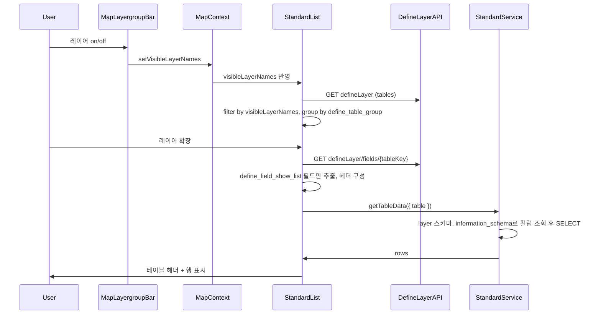

# StandardList defineLayer 및 켜진 레이어 연동 계획

## 현재 구조 정리

- **켜진 레이어 상태**: [map-layergroup-bar.tsx](src/app/(pages)/map/_mapComponents/map-layergroup-bar.tsx) 내부 로컬 state `visibleLayerNames` (Set&lt;string&gt;)에만 존재. StandardList와 형제 관계라 직접 공유 불가.
- **defineLayer**: [tables.json](src/config/defineLayer/tables.json) (define_table_name, define_table_kor_name, define_table_group 등), 필드는 `fields/table_{tableKey}.json` ([fields API](src/app/api/config/defineLayer/fields/[tableKey]/route.ts): `tableKey`로 `table_${tableKey}.json` 로드).
- **필드 “목록 표시” 플래그**: 각 필드의 `define_field_show_list === "true"` 인 항목만 목록 테이블 헤더/컬럼으로 사용 (예: [table_complaint_intl_lek.json](src/config/defineLayer/fields/table_complaint_intl_lek.json)).
- **데이터 조회**: 현재는 devTestService에 `getDataSelectTableList` / `getDataSelectFieldList` / `getDataSelectValueList`만 있고, **테이블 이름만으로 행을 SELECT하는 API는 없음**.

---

## 1. 켜져 있는 레이어 목록을 지도 → StandardList로 전달

**목표**: 레이어 그룹/목록을 “현재 켜져 있는 레이어”로 한정하고, 해당 테이블 이름 목록을 StandardList가 사용하도록 한다.

- **방안**: `visibleLayerNames`를 공유 Context로 올린다.
  - [MapContext.tsx](src/app/(pages)/map/_mapComponents/MapContext.tsx)에 다음을 추가:
    - `visibleLayerNames: Set<string>`
    - `setVisibleLayerNames: Dispatch<SetStateAction<Set<string>>>`
  - 초기값: `useState<Set<string>>(() => new Set())`.
- **MapLayergroupBar**:
  - 로컬 `useState` 제거하고 `useMapContext()`의 `visibleLayerNames` / `setVisibleLayerNames` 사용.
  - 기존 `updateWmsParams(nextSet, ...)` 호출 등은 그대로 유지 (인자만 context에서 온 Set 사용).
- **StandardList**:
  - `useMapContext()`로 `visibleLayerNames` 구독.
  - **레이어/그룹 목록의 기준은 켜진 레이어(visibleLayerNames)**이다. 즉, “무엇을 목록에 넣을지”는 defineLayer가 아니라 현재 켜져 있는 레이어(테이블 이름 집합)로 결정한다. 그룹명·레이어명 등 표시용 메타는 defineLayer에서 조회해 보완한다.

이렇게 하면 “지도에서 켜진 레이어 = 목록에 보이는 그룹/레이어”가 되고, StandardList는 테이블 이름 목록을 지도 컴포넌트(맥락상 MapLayergroupBar가 갱신하는 context)로부터 받는 형태가 됨.

---

## 2. 레이어·그룹 목록은 켜진 레이어 기준, 메타는 defineLayer에서 조회

**목표**: **표시할 레이어/그룹 목록 자체는 켜진 레이어(visibleLayerNames)를 기준으로 한다.** defineLayer는 “목록의 소스”가 아니라, 켜진 레이어 각각에 대한 그룹명·한글명 등을 가져오기 위한 메타 소스로만 사용한다.

- **목록의 기준(우선)**:
  - StandardList에 보여줄 항목 = **현재 켜져 있는 레이어** = `visibleLayerNames`에 들어 있는 테이블 이름들. 이 집합이 곧 “어떤 그룹/레이어를 나열할지”의 기준이다.
- **메타 정보(보완)**:
  - 켜진 레이어 각각에 대해 그룹명·레이어 표시명을 알기 위해 defineLayer를 **조회**한다.
  - [tables.json](src/config/defineLayer/tables.json)과 동일한 데이터: `GET /api/config/defineLayer` (전체) 호출 후, **응답 중 `define_table_name`이 `visibleLayerNames`에 포함된 행만** 사용한다. (즉, defineLayer 전체가 목록을 만드는 것이 아니라, 켜진 레이어에 해당하는 행만 골라 쓴다.)
  - 그룹화: 위에서 골라낸 행들을 `define_table_group`(빈 값이면 '(미분류)') 기준으로 그룹화. 정렬은 그룹 → define_table_idx → 이름 순 유지.
- **StandardList UI**:
  - “그룹 → 레이어” 트리 구조 유지.
  - 그룹명: `define_table_group` (또는 '(미분류)').
  - 레이어명: `define_table_kor_name` 우선, 없으면 `define_table_name`.
  - 각 레이어는 `define_table_name`을 테이블 식별자로 사용 (데이터 조회·필드 정의에 사용).

---

## 3. 테이블 정의 및 테이블 헤더(define_field_show_list)

**목표**: 데이터 테이블의 “정의”와 “헤더에 나올 컬럼”을 defineLayer 필드 설정에서 가져온다.

- **테이블 정의 소스**: defineLayer 필드 API  
`GET /api/config/defineLayer/fields/{tableKey}`  
(내부적으로 [fields/table_{tableKey}.json](src/app/api/config/defineLayer/fields/[tableKey]/route.ts) 사용.)
- **헤더에 쓸 필드**:
  - 응답 필드 배열 중 `**define_field_show_list === "true"**` 인 항목만 사용.
  - 정렬: `define_field_idx` 또는 `define_field_sort_idx` 등 기존 정렬 규칙 유지 (필드 API sortFields 참고).
- **매핑**:
  - 테이블 헤더 텍스트: `define_field_kor_name`
  - 셀 데이터 키(컬럼 식별자): `define_field_name`
- **StandardList**:
  - 레이어(테이블) 하나를 펼칠 때 해당 `define_table_name`으로 필드 API 호출 → show_list 필드만 추려서 테이블 헤더/컬럼 정의로 사용.

---

## 4. 테이블 이름만으로 데이터 SELECT (백엔드)

**목표**: “테이블 이름만 넣으면” 해당 DB 테이블의 컬럼을 기준으로 SELECT 쿼리를 만들어 행을 반환한다.

- **위치**: **새 파일** [standardService.ts](src/service/standardService.ts) 생성. devTestService가 아닌 이 파일에 구현한다.
- **새 함수 (예: `getTableData`)**:
  - **파라미터**: `{ table: string; limit?: number; offset?: number }` — 스키마 전달 기능은 없음.
  - **스키마**: **고정값 `layer**`. 레이어 데이터는 항상 `layer` 스키마에서 가져온다. (상수로 정의, 파라미터로 받지 않음.)
  - **로직**:
    1. `information_schema.columns`에서 `table_schema = 'layer'` 및 해당 `table_name`의 컬럼 목록을 `ordinal_position` 순으로 조회.
    2. 조회된 컬럼명만으로 `SELECT "col1", "col2", ... FROM "layer"."table"` 형태의 쿼리 구성 (SQL injection 방지: 테이블/컬럼명 이스케이프).
    3. `LIMIT` / `OFFSET` 적용 (기본 limit 예: 500, max 상한 설정 권장).
  - **반환**: `{ rows: Record<string, unknown>[] }` 또는 기존 패턴에 맞춰 `{ data: [...] }` 등 일관된 형태.
- **API 노출**: [service/index.ts](src/service/index.ts)에 `standardService`를 import 후 export 추가. 중앙 API([app/api/route.ts](src/app/api/route.ts))는 `@/service`의 모든 export를 사용하므로, `call('', 'POST', { service: 'standardService', action: 'getTableData', params: { table, limit, offset } })` 로 호출 가능.

---

## 5. StandardList에서 데이터 로드 및 표시

**목표**: 켜진 레이어 중 하나의 “테이블”을 펼치면, 해당 테이블 이름으로 자동 SELECT 후 defineLayer 기반 헤더로 표시한다.

- **호출 시점**: 레이어 행을 확장(펼침)할 때, 해당 레이어의 `define_table_name`에 대해:
  1. (이미 3번에서) defineLayer 필드 API로 `define_field_show_list` 컬럼 목록 확보.
  2. `getTableData({ table: define_table_name, limit, offset })` 호출 (service: `standardService`, 스키마는 백엔드에서 `layer` 고정).
- **표시**:
  - 헤더: 3번에서 구한 `define_field_kor_name` 순서대로.
  - 각 행: 백엔드에서 받은 객체의 `define_field_name` 키 값으로 셀 렌더링.
  - defineLayer에 없는 컬럼이 DB에 있을 수 있으므로, “헤더는 define_field_show_list 기준, 셀은 해당 키가 있으면 표시” 방식으로 처리하면 됨. 반대(정의에는 있는데 DB에 없으면 빈칸)도 허용.
- **페이징/로딩**: 필요 시 `limit`/`offset`으로 추가 요청 (무한 스크롤 또는 페이지 버튼). 1차는 고정 limit으로 구현해도 됨.

---

## 6. 데이터 흐름 요약

---

## 7. 구현 시 유의사항

- **스키마**: getTableData는 `layer` 스키마 고정. 스키마 전달 기능은 없음.
- **필드 파일 없음**: 특정 테이블에 대해 `fields/table_{tableKey}.json`이 없으면 필드 API는 빈 배열을 반환. 이 경우 헤더가 비거나, fallback으로 getDataSelectFieldList(DB 컬럼)만 사용하는 방안을 나중에 넣을 수 있음.
- **공간검색/데이터선택 도구**: 현재 StandardList의 “공간검색”, “데이터 선택” 등은 그대로 두고, “레이어 그룹/목록 + 테이블 데이터” 부분만 위와 같이 바꾸면 됨. 필요하면 이후에 해당 도구와 켜진 레이어/defineLayer를 연동하는 단계를 추가할 수 있음.

---

## 8. 작업 순서 제안

1. **MapContext 확장** → MapLayergroupBar에서 context 사용하도록 변경 → StandardList에서 visibleLayerNames 구독 (켜진 레이어 전달 확인).
2. **StandardList**: defineLayer tables fetch + visibleLayerNames 필터 + 그룹화하여 레이어 트리 데이터 소스 교체.
3. **StandardList**: 레이어 확장 시 defineLayer fields API 호출, define_field_show_list 기준 헤더 구성.
4. **standardService.ts 신규 생성**: getTableData 구현 (스키마 `layer` 고정, information_schema 기반 SELECT). [service/index.ts](src/service/index.ts)에 standardService export 추가.
5. **StandardList**: 레이어 확장 시 getTableData 호출 후 테이블 바디 렌더링 (기존 하드코딩 LAYER_GROUPS/rows 제거).

이 순서로 진행하면 “켜진 레이어 → defineLayer → DB SELECT”까지 한 번에 연동할 수 있다.