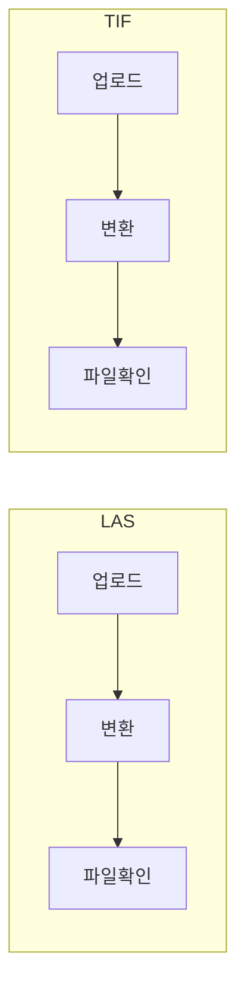

# 업로드 → 변환 → 파일 확인 절차 및 UI 개선

## 목표

1. **절차 고정**: **업로드 → 변환 → 파일 확인** 순서로 진행되며, 각 단계를 사용자가 확인할 수 있어야 함.
2. **두 종류 구분**
   - **LAS**: 업로드( upload_data/las ) → 변환( 음영기복도 + b3dm ) → 결과 확인( service_data/hillshade, service_data/3dtiles ).
   - **TIF**: 업로드( upload_data/tif ) → 변환( COG ) → 결과 확인( service_data/gis_map_data ).
   UI는 두 종류 모두 표현, **구현은 LAS만 먼저**.
3. **상태 확인**: 업로드 완료 여부, 변환 진행/완료/실패, 생성된 파일 목록을 화면에서 확인 가능.
4. **이력 표**: 업로드 및 변환된 모든 파일 목록과 이력을 한눈에 볼 수 있는 표를 **화면 우측 절반**에 배치.

---

## 절차 흐름

- **LAS**: upload_data/las 저장 → (자동) Python 음영기복도 + b3dm → service_data/hillshade, service_data/3dtiles 에서 파일 확인.
- **TIF**: upload_data/tif 저장 → (추후) Python COG 변환 → service_data/gis_map_data 에서 파일 확인. (UI만 준비, 변환 구현은 후순위.)

---

## 레이아웃: 좌측 / 우측 분할

- **화면을 세로로 반으로 나눔.**
  - **좌측**: 기존 File Manager — 폴더 목록(상위로, 테이블, 새로고침) + 하단 업로드 영역(LAS/TIF 탭, 업로드 → 변환 → 파일 확인 3단계).
  - **우측**: **업로드·변환 파일 목록 및 이력 표** — 업로드된 파일과 변환 결과를 시간순·타입별로 보여주는 테이블.

---

## 우측: 업로드·변환 파일 목록 및 이력 표

### 목적

- 업로드된 모든 파일( upload_data/las, upload_data/tif )과, 그에 대해 실행된 변환(음영기복도, b3dm, COG) 결과를 **한 테이블에서** 확인.
- 이력으로 "언제 어떤 파일이 올라왔고, 변환이 완료/실패했는지" 추적 가능.

### 테이블 구성 (컬럼 제안)

| 컬럼 | 설명 |
|------|------|
| **일시** | 업로드 또는 변환 완료 시각 (최신순 정렬 기본) |
| **구분** | `업로드` / `변환(음영기복도)` / `변환(b3dm)` / `변환(COG)` 등 |
| **원본 파일** | 업로드된 파일명 (예: sample.las, ortho.tif) |
| **경로/결과** | 저장 경로 또는 변환 결과 경로 (예: upload_data/las/sample.las, service_data/hillshade/sample_hillshade.tif) |
| **상태** | `완료` / `변환 중` / `실패` 등 |
| **(선택) 비고** | 에러 메시지 또는 로그 요약 |

- **데이터 소스**:  
  - **옵션 A**: 서버에 이력 저장(DB 또는 JSON 파일). 업로드 완료·변환 완료 시마다 한 줄씩 추가. API로 `fileManagerService.getUploadConvertHistory({ limit?, type?: 'las'|'tif' })` 조회.  
  - **옵션 B**: 이력 API 없이, 우측에서 "upload_data/las", "upload_data/tif", "service_data/hillshade", "service_data/3dtiles" 등 폴더별 최근 파일 목록을 모아서 "최근 파일" 형태로 표시. (진짜 이력은 아니지만 구현이 단순.)

### UI 배치

- File Manager 본문을 **flex 또는 grid로 50% : 50%** 분할.
- 좌측: 기존 본문 + 업로드 섹션 (스크롤 가능).
- 우측: **고정 제목 "업로드·변환 이력"** + 테이블 (세로 스크롤). 반응형으로 narrow 시 우측을 아래로 내리거나 탭으로 전환할 수 있음.

### 구현 시 유의

- 이력 데이터를 서버에 쌓으려면: `completeChunkedUpload` 성공 시 "업로드" 이력 1건 추가, LAS 변환 완료 시 "변환(음영기복도)", "변환(b3dm)" 각 1건 추가. 저장소는 DB 테이블 또는 `d:\ggnr_data_dir\.meta\history.json` 같은 파일로 관리.
- 우측 표만 먼저 만들고, 초기에는 "이력 API 연동 예정" 플레이스홀더로 두고 좌측과 레이아웃(반으로 자르기)만 맞춰도 됨.

---

## UI 개선 방향 (좌측 하단)

### 1. 절차·타입 구분 표시

- **타입 탭 또는 섹션**: "LAS (음영기복도 + b3dm)" / "TIF (COG)" 두 가지를 명확히 구분.
  - 각 타입별로 **업로드 / 변환 / 파일 확인** 3단계를 한 화면에 표시.
- **LAS 섹션 예시**
  - **1) 업로드**: 기존 드래그앤드롭 + 진행률. 완료 시 "업로드 완료 → 변환 자동 시작" 안내.
  - **2) 변환**: 상태 표시. `대기 중` / `변환 중` / `완료` / `실패`. (서버에서 변환 작업 상태를 조회하는 API가 있으면 연동; 없으면 "업로드 완료 시 자동 변환됨" 문구 + 결과 폴더 새로고침으로 확인.)
  - **3) 파일 확인**: **service_data/hillshade**, **service_data/3dtiles** 폴더로 이동하는 링크 또는 "결과 보기" 버튼으로 해당 경로 목록 조회.
- **TIF 섹션**
  - 동일한 3단계 레이아웃. 업로드는 현재처럼 upload_data/tif. 변환·파일 확인은 "준비 중" 또는 "추가 예정" 등으로 표시.

### 2. 상태 확인

- **업로드**: 기존대로 진행률 + "업로드 완료" 메시지.
- **변환**: 옵션 A(상태 API) 또는 옵션 B(안내 문구 + 파일 확인).
- **파일 확인**: "음영기복도 결과 보기" / "b3dm 결과 보기"로 해당 폴더 목록 표시 또는 경로 이동.

### 3. 좌측 레이아웃 요약

- 상단: upload_data 목록(상위로, 테이블, 새로고침).
- 하단: LAS / TIF 탭 → 업로드 영역, 변환 상태, 파일 확인 링크/버튼.

---

## 구현 범위 (LAS만 먼저)

- **백엔드**
  - LAS 업로드 완료 시 자동 변환(음영기복도 + b3dm) 호출.
  - (선택) 변환 작업 상태 조회 API, **업로드·변환 이력 저장 및 조회 API**.
- **Python**
  - LAS 1개 입력 → hillshade → service_data/hillshade, b3dm → service_data/3dtiles.
  - TIF/COG 파이프라인은 구현하지 않음.
- **프론트(File Manager)**
  - **화면 반으로 분할**: 좌측 = 폴더 목록 + 업로드/변환/파일확인 3단계(LAS·TIF 구분), **우측 = 업로드·변환 파일 목록 및 이력 표**.
  - LAS: 변환 상태(있으면 API 연동), 결과 보기 버튼.
  - TIF: 업로드 + "COG 변환 예정" 안내.
  - 우측 표: 이력 API 있으면 연동, 없으면 플레이스홀더 또는 폴더별 최근 파일 목록으로 대체.

---

## 구현 순서 요약

1. **백엔드·Python (LAS만)**
   - pipelineService.runLasPipeline, uploadService에서 LAS 완료 시 비동기 호출.
   - Python: hillshade + b3dm, 출력 service_data/hillshade, service_data/3dtiles.
2. **(선택) 변환 상태 API + 이력 API**
   - getLastLasJobStatus, **getUploadConvertHistory** (이력 저장은 completeChunkedUpload·변환 완료 시 추가).
3. **File Manager UI**
   - **좌우 50:50 분할 레이아웃.**
   - 좌측: 기존 + LAS/TIF 탭, 업로드 → 변환 → 파일 확인 3단계.
   - **우측: 업로드·변환 이력 표** (컬럼: 일시, 구분, 원본 파일, 경로/결과, 상태). 이력 API 연동 또는 최근 파일 목록으로 초기 구현.

이렇게 하면 업로드 → 변환 → 파일 확인 절차와 LAS/TIF 구분이 명확하고, **우측에서 업로드·변환된 모든 파일 목록과 이력을 한 표로 확인**할 수 있다.
