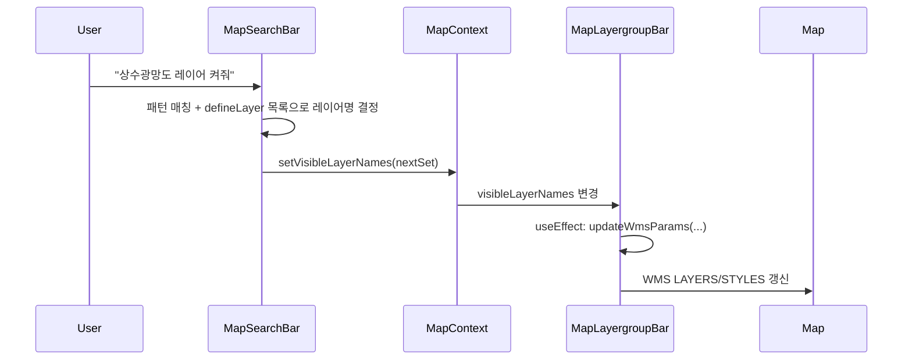
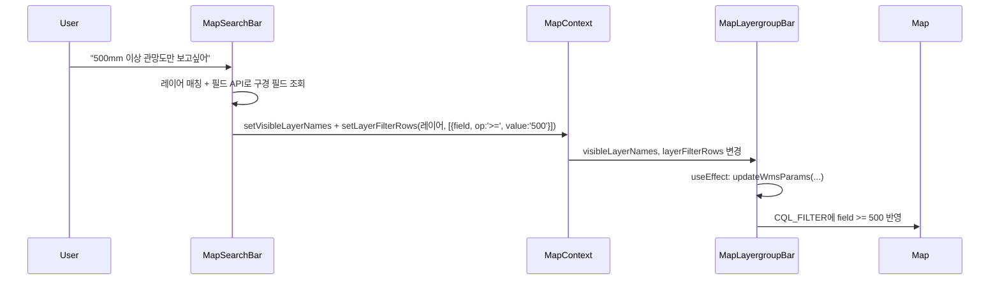

# 통합검색창 AI 레이어 제어 기능

## 현재 구조 요약

- **통합검색창**: [map-search-bar.tsx](src/app/(pages)/map/_mapComponents/map-search-bar.tsx) — 현재는 `q` 파라미터로 주소/지번 검색만 수행.
- **레이어 상태**: [MapContext.tsx](src/app/(pages)/map/_mapComponents/MapContext.tsx)의 `visibleLayerNames`(Set), `setVisibleLayerNames`로 전역 관리.
- **레이어 목록**: `GET /api/config/defineLayer` → `{ data: DefineLayerRow[] }`. 각 row에 `define_table_name`, `define_table_kor_name`, `define_table_group` 사용.
- **WMS 갱신**: [map-layergroup-bar.tsx](src/app/(pages)/map/_mapComponents/map-layergroup-bar.tsx)의 `updateWmsParams(visibleNames, layerFilterRows)`가 지도 레이어를 갱신. 현재는 **패널/그룹 버튼에서만** 이 함수를 호출하고 있어, **검색창에서 `setVisibleLayerNames`만 호출하면 지도 WMS는 갱신되지 않음**.

## 구현 방향 (2가지 옵션)

| 방식             | 장점                       | 단점                            |
| -------------- | ------------------------ | ----------------------------- |
| **A. 규칙 기반**   | API 키 불필요, 즉시 동작, 의존성 없음 | 표현이 제한적 (예: "상수관망 레이어 켜줘" 형태) |
| **B. LLM API** | 자연어 다양하게 이해 가능           | API 키/비용, 새 의존성, 지연 시간        |

**권장**: 먼저 **A**로 구현한 뒤, 필요 시 **B**를 추가하는 하이브리드가 적절합니다.

---

## 1단계: 규칙 기반 AI (권장 1차 구현)

### 1-1. 검색창에서 레이어 명령 처리

- **파일**: [map-search-bar.tsx](src/app/(pages)/map/_mapComponents/map-search-bar.tsx)
- **추가 동작**:
  - `useMapContext()`로 `setVisibleLayerNames` 사용.
  - 레이어 목록: `fetch('/api/config/defineLayer')`로 한 번 로드 (메모이제이션 또는 훅으로 캐시).
  - **제출 시 분기**:
    - 입력이 **레이어 명령 패턴**이면 → 레이어 매칭 후 표시 토글.
    - 아니면 → 기존처럼 `router.push`로 주소 검색 (`q` 유지).
- **명령 패턴 예시** (정규식/키워드):
  - 켜기: `"(.*?) 레이어 켜줘"`, `"(.*?) 켜줘"`, `"(.*?) 보여줘"`, `"(.*?) 켜"`
  - 끄기: `"(.*?) 레이어 끄줘"`, `"(.*?) 끄줘"`, `"(.*?) 숨겨줘"`
- **레이어 매칭**: 패턴에서 추출한 문자열(예: "상수광망", "상수관망")으로 `tableList`를 검색. `define_table_kor_name`, `define_table_name`에 **포함(contains)** 또는 **한글 유사** 매칭 후, 매칭되는 첫 row의 `define_table_name`으로 Set 갱신 (`add` / `delete`).

### 1-2. WMS 동기화 (검색창에서 켠 레이어가 지도에 반영되도록)

- **현재**: `setVisibleLayerNames`만 호출하면 [map-layergroup-bar.tsx](src/app/(pages)/map/_mapComponents/map-layergroup-bar.tsx)의 `updateWmsParams`는 호출되지 않음.
- **해결**: `map-layergroup-bar.tsx`에 **useEffect** 추가 — `visibleLayerNames` 또는 `layerFilterRows` 변경 시 `updateWmsParams(visibleLayerNames, layerFilterRows)` 호출.  
→ 검색창에서 `setVisibleLayerNames`만 호출해도 지도 WMS가 자동 갱신됨.

### 1-3. UX 보조

- placeholder 확장: 예) `"주소 검색 또는 '상수관망 레이어 켜줘'"`.
- (선택) 레이어 명령 실행 시 짧은 토스트/메시지: "상수관망 레이어를 켰습니다."

---

## 2단계 (선택): LLM API로 확장

- **새 API 라우트**: 예) `POST /api/map/parse-command`  
  - Body: `{ query: string, layerList: { name: string, korName: string }[] }`  
  - 응답: `{ action: 'toggle_layer' | 'search_address', layerName?: string, turnOn?: boolean }`
- **클라이언트**: 규칙으로 의도 판별이 애매할 때만 이 API 호출 후, `layerName`으로 `define_table_name` 매칭해 `setVisibleLayerNames` 호출.
- **의존성**: OpenAI / Anthropic 등 SDK 추가 시 `package.json` 및 환경변수(API 키) 필요.

---

## 데이터 흐름 (규칙 기반)

---

## 수정/추가 파일 요약

| 파일                                                                                  | 변경 내용                                                                             |
| ----------------------------------------------------------------------------------- | --------------------------------------------------------------------------------- |
| [map-search-bar.tsx](src/app/(pages)/map/_mapComponents/map-search-bar.tsx)         | useMapContext, defineLayer fetch, 명령 패턴 판별 및 레이어 매칭, submit 시 분기(레이어 토글 vs 주소 검색) |
| [map-layergroup-bar.tsx](src/app/(pages)/map/_mapComponents/map-layergroup-bar.tsx) | `visibleLayerNames`/`layerFilterRows` 변경 시 `updateWmsParams` 호출하는 useEffect 추가    |

이렇게 하면 별도 AI 서비스 없이도 "상수광망도 레이어 켜줘" 같은 문장으로 레이어가 켜지고, 나중에 LLM을 붙이기만 하면 더 다양한 표현을 처리할 수 있습니다.

---

## "500mm 이상 관망도만 보고싶어" 같은 조건 필터 지원

**가능합니다.** 다만 다음 확장이 필요합니다.

### 현재 제약

- **필터 구조**: [map-layergroup-bar.tsx](src/app/(pages)/map/_mapComponents/map-layergroup-bar.tsx)의 `LayerFilterRow`는 `{ field, value }`만 있고, CQL은 **동등 비교(`field='value'`)만** 생성합니다. (`filterRowsToCql` 참고.)
- **필터 소유**: `layerFilterRows`는 `map-layergroup-bar`의 로컬 state라서, 검색창에서 "500mm 이상만 보여줘"라고 해도 **필터를 설정할 경로가 없습니다.**

### 필요한 변경

1. **필터 타입 확장 (연산자 지원)**
  - `LayerFilterRow`를 `{ field: string; value: string; op?: '=' | '>=' | '<=' | '>' | '<' }` 형태로 확장. 기본값 `'='`.  
  - `filterRowsToCql`에서 `op`에 따라 CQL 생성:  
    - `>=`, `<=`, `>`, `<` → 숫자면 따옴표 없이 `field >= 500`, 문자열이면 GeoServer 규칙에 맞게 처리.
  - 필드 타입은 `GET /api/config/defineLayer/fields/{tableKey}` 응답의 `define_field_type`(예: NUMBER, TEXT)으로 판단 가능. (이미 [LayerManagementPanel](src/app/(pages)/map/_mapComponents/LayerManagementPanel.tsx)에서 필드 목록 사용 중.)
2. **layerFilterRows를 MapContext로 승격**
  - `MapContext`에 `layerFilterRows`, `setLayerFilterRows`(또는 `onLayerFilterChange`) 추가.  
  - `map-layergroup-bar`는 context에서 읽고 갱신하고, **검색창**에서도 "500mm 이상" 명령 시 해당 레이어에 대해 context의 `setLayerFilterRows`로 `{ field: 구경필드명, op: '>=', value: '500' }` 설정.  
  - WMS 갱신은 기존처럼 `visibleLayerNames`/`layerFilterRows` 변경 시 `updateWmsParams` 호출하는 useEffect로 일괄 처리.
3. **검색창에서 조건 해석**
  - 패턴 예: "500mm 이상 (관망도|상수관망|…)만 보고싶어", "300 이하만", "구경 500 이상".  
  - 단계:  
    - **레이어 매칭**: "관망도", "상수관망" 등으로 테이블 목록에서 레이어(들) 결정. (여러 개면 첫 번째 또는 사용자 선택 가능.)  
    - **필드 매칭**: 해당 레이어의 `GET /api/config/defineLayer/fields/{tableKey}` 결과에서 `define_field_kor_name`이 "구경", "관경", "직경" 등인 필드 선택 (우선 숫자형).  
    - **값/연산자**: "500mm 이상" → `op: '>=', value: '500'` (숫자만 추출).
  - 설정: 해당 레이어 켜기 + context의 `setLayerFilterRows`에 `[{ field, op: '>=', value: '500' }]` 설정.
4. **UI (레이어 관리 패널)**
  - 기존 필터 UI는 `op`이 없으면 `'='`로 동작하도록 호환.  
  - (선택) 필터 행에 연산자 드롭다운(`=`, `>=`, `<=`, `>`, `<`) 추가하면, 패널에서도 "500 이상" 같은 조건을 수동으로 넣을 수 있음.

### 데이터 흐름 (조건 필터 예시)

### 수정/추가 파일 (조건 필터까지 포함 시)

| 파일                                                                                      | 변경 내용                                                                                                                    |
| --------------------------------------------------------------------------------------- | ------------------------------------------------------------------------------------------------------------------------ |
| [MapContext.tsx](src/app/(pages)/map/_mapComponents/MapContext.tsx)                     | `layerFilterRows`, `setLayerFilterRows` (또는 레이어별 필터 설정 콜백) 추가.                                                           |
| [map-layergroup-bar.tsx](src/app/(pages)/map/_mapComponents/map-layergroup-bar.tsx)     | `LayerFilterRow`에 `op` 추가, `filterRowsToCql`에서 `>=`/`<=`/`>`/`<` 지원, context에서 `layerFilterRows` 구독, useEffect로 WMS 동기화. |
| [LayerManagementPanel.tsx](src/app/(pages)/map/_mapComponents/LayerManagementPanel.tsx) | 필터 행에 `op` 반영 (기본 `'='`, 선택 사항으로 연산자 선택 UI).                                                                             |
| [map-search-bar.tsx](src/app/(pages)/map/_mapComponents/map-search-bar.tsx)             | "숫자+단위(mm) 이상/이하" 패턴 인식, 레이어+필드(구경/관경/직경) 매칭 후 `setVisibleLayerNames` + `setLayerFilterRows` 호출.                         |

정리하면, **"500mm 이상 관망도만 보고싶어"** 같은 문장도 위 확장을 적용하면 규칙 기반으로 처리 가능하고, 더 복잡한 문장은 2단계 LLM으로 넘기면 됩니다.